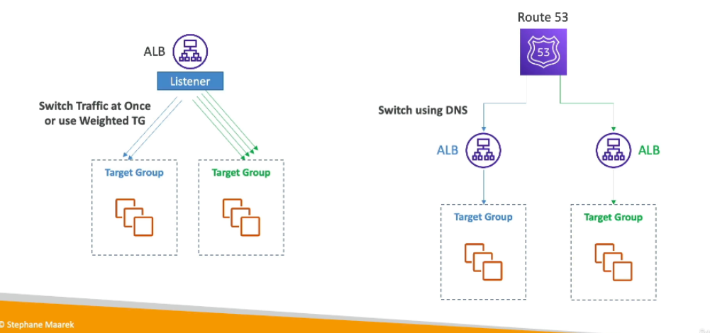
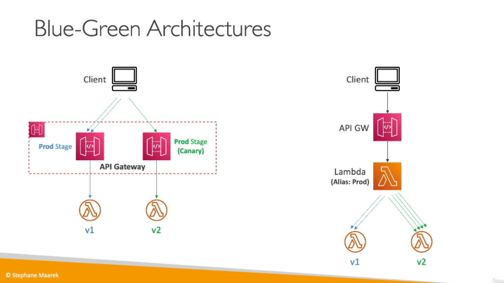

# Resilient Architectures

## Multi AZ in AWS

- Services where multi AZ must be enabled manually:
  - EFS, ELB, ASG, Elastic Beanstalk
  - RDS, OpenSearch: multi AZ used for failovers
  - Aurora:
    - Data is stored automatically across multi AZ
    - It can have multi AZ for DB itself (multi master, read replicas, multi AZ deployments)
  - OpenSearch (managed): multi master
  - Jenkins (self-hosted): multi master
- Services where multi az is implicitly enabled:
  - S3 (except OneZone-IA)
  - DynamoDB: data is replicated by default
  - All of AWS proprietary managed services()

## EBS - Multi AZ

- EBS is tied to a single AZ
- How can we make EBS multi AZ?
  - We crate an ASG with 1 min/max/desired capacity
  - We create a lifecycle hook for `Terminate`: make a snapshot of the EBS volume
  - We create a lifecycle hook fot `Start`: copy the snapshot, create an EBS, attach it to the instance
- Note: for PIOPS volumes (IO1), to get max performance after snapshot, read the entire volume once (pre warming of IO blocks)

## Blue-Green Architecture

- Blue-Green with ALB and Route53:

- Blue-Green with AWS Lambda:

## Multi Region Services

- DynamoDB Global Tables: multi wau replication, enabled by Streams
- AWS Config Aggregators: multi region and multi account aggregated view in one account
- RDS Cross Region Read Replicas: used for Read and disaster recovery
- Aurora Global Database: one region is master, other is for read and disaster recovery
- EBS volumes snapshots, AMI, RDS snapshots can be copied to other regions
- VPC peering to allow private traffic between regions
- Route 53 uses a global network of DNS servers
- S3 Cross Region Replication
- CloudFront: CDN at the Edge Locations
- Lambda@Edge for Global Lambda function at Edge Location (A/B testing)

## Multi Region with Route 53

- Routing to multiple regions: latency, geo-location, geo-proximity routing
- Health Check: we can have DNS failover to different regions
- Health Check types:
  1. Health checks monitoring an endpoint: application server, other AWS resource
  2. Health checks that monitor other health checks (calculated health checks)
  3. Health check that monitor CloudWatch alarms: example throttles of DynamoDB, custom metrics, etc.

## CloudFormation StackSets

- Create, update or delete stacks across multiple accounts and regions with a single operation
- Administrator account is allowed to create StackSets
- Trusted accounts are allowed to create, update and delete instances from StackSets
- When we update a StackSet in the administrator account, all the associated stack instances are updated through all accounts and regions
- Ability to set a maximum concurrent actions on targets (# or %)
- Ability to set failure tolerance (# or %)

## Multi Region CodePipeline

- Reference: [https://aws.amazon.com/blogs/devops/using-aws-codepipeline-to-perform-multi-region-deployments/](https://aws.amazon.com/blogs/devops/using-aws-codepipeline-to-perform-multi-region-deployments/)
- In order to do multi region deployments, the artifact store must be copied across regions
