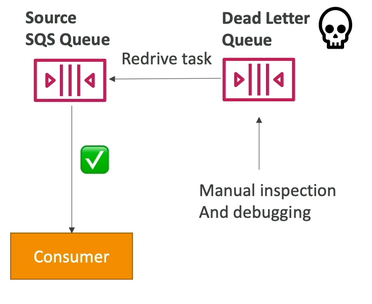

# SNS and SQS

## SQS Dead Letter Queue (DLQ)

- If a consumer fails to process a message within the `VisibilityTimeout`, the message will be placed back to the queue
- We can set a threshold of how many times a message can be placed back to the queue (`MaximumReceives` threshold)
- After this threshold is exceeded, the messages are placed back to the DLQ
- DLQ of a FIFO queue must be a FIFO queue. 
- DLQ of a Standard queue must also be a Standard Queue
- Make sure to process the messages in the DLQ before they expire:
    - good to set a retentation of 14 day in the DLQ 
- **Redrive to Source**:
    - It is a feature which helps consume messages in the DLQ to understand what is wrong with them
    - When our code is fixed, we can redrive the messages from the DLQ back into source queue (or any other queue) in batches without writing custom code

## SNS Dead Letter Queue (DLQ)

- After exhausting the delivery policy (delivery retries) messages that haven't been delivered are discarded unless we set a DLQ
- **Redrive Policy**: JSON object that refers to the ARN of the DLQ (SQS or SQS FIFO)
- DLQ is attached to SNS at Subscription-level (rather than the SNS topic)