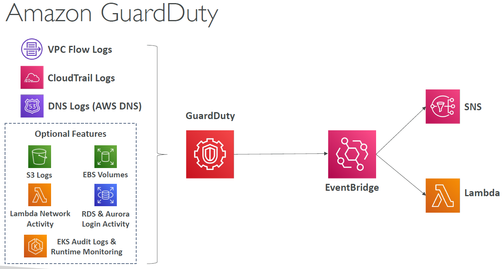

# GuardDuty

- Intelligent Threat discovery to protect AWS accounts
- Uses machine learning algorithms to perform anomaly detection, uses 3rd party data
- One click to enable, has 30 days trial, no need to install any software
- Input data includes:
  - CloudTrail Logs: unusual API calls, unauthorized deployments
  - VPC Flow Logs: unusual internal traffic, unusual IP addresses
  - DNS Logs: compromised EC2 instances sending encoded data within DNS queries
  - Optional Features: EKS Audit Logs, RDS and Aurora, EBS, Lambda, S3 Data Events, etc.
- We can set up EventBridge rules to notify us in case of findings
- EventBridge rules can target AWS Lambda or SNS
  **- Can protect against CryptoCurrency attacks (has a dedicated "finding" for it)** -Exam question
  

## Multi-Account Strategy

- We can manage multiple accounts in GuarDuty by using AWS Organizations
- Member accounts can be managed with the administrator account
- Administrator can do the following:
  - Add/remove member accounts in GuarDuty
  - Manage GuarDuty within the associated member accounts
  - Manage findings, suppression rules, trusted IP lists, treat list
- The administrator of GuarDuty does not necessarily have to be the administrator of the organization, we can have delegated administrators for GuarDuty

## Findings Automated Response

- Findings are potential security issues for malicious events happening in our AWS account
- We can automate the response to security issues revealed by GuarDuty Findings using EventBridge
- Events are published to both the administrator account and the member account that it is originated from

## Findings

- GuarDuty pulls independent streams of data directly from CloudTrail logs, VPC Flow Logs and EKS logs
- Each finding has a severity value between 0.1 and 8+ (High, Medium, Low)
- There is a finding naming convention: `ThreatPurpose:ResourceTypeAffected/ThreatFamilyName.DetectionMechanism!Artifact`
  - `ThreatPurpose`: primary purpose of the threat (Backdoor, CryptoCurrency, etc.)
  - `ResourceTypeAffected`: AWS resource affected
  - `ThreatFamilyName`: describes the potential malicious activity (NetworkPortUnusual, etc.)
  - `DetectionMechanism`: method used by GuarDuty to detect the finding (TCP, UDP, etc.)
  - `Artifact`: resource that is used in the malicious activity (DNS, etc.)
- We can generate sample findings in GuarDuty to test our automations
- Finding types:
  - EC2 Finding Types
  - IAM Finding Types
  - Kubernetes Audit Logs Finding Types
  - Malware Protection Finding Types
  - RDS Protection Finding Types
  - S3 Finding Types

## Trusted and Threat IP Lists

- Works only for public IP addresses
- We can define a list of trusted IP addresses (Trusted IP List):
  - These are CIDR ranges that we trust
  - GuarDuty does not generate findings for these
- Threat IP List:
  - List of know malicious IP addresses and CIDR ranges
  - GuarDuty will generate findings based on these IP ranges
  - Can be supplied by 3rd party threat intelligence or created custom by us

## CloudFormation Integration

- We can enable GuarDuty from CloudFormation template
- If GuarDuty is already enabled, the CloudFormation Stack deployment will fail
- **We can use Custom Resources (Lambda) to conditionally enable GuarDuty if it is not enabled yet** - exam question
- We can then deploy this across all the organization using Stack Sets

- Amazon GuardDuty is a threat detection service that continuously monitors for malicious activity and unauthorized behavior to protect your AWS accounts