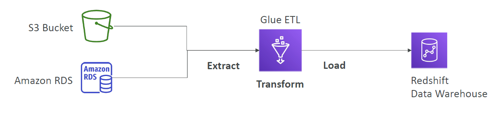
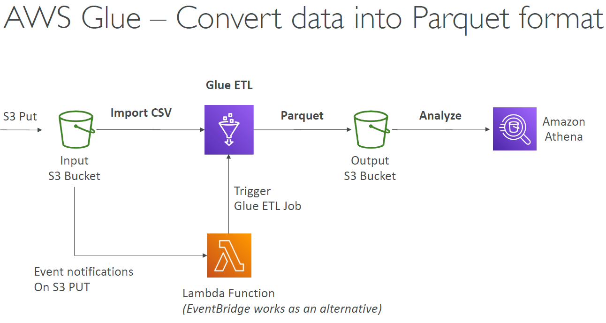
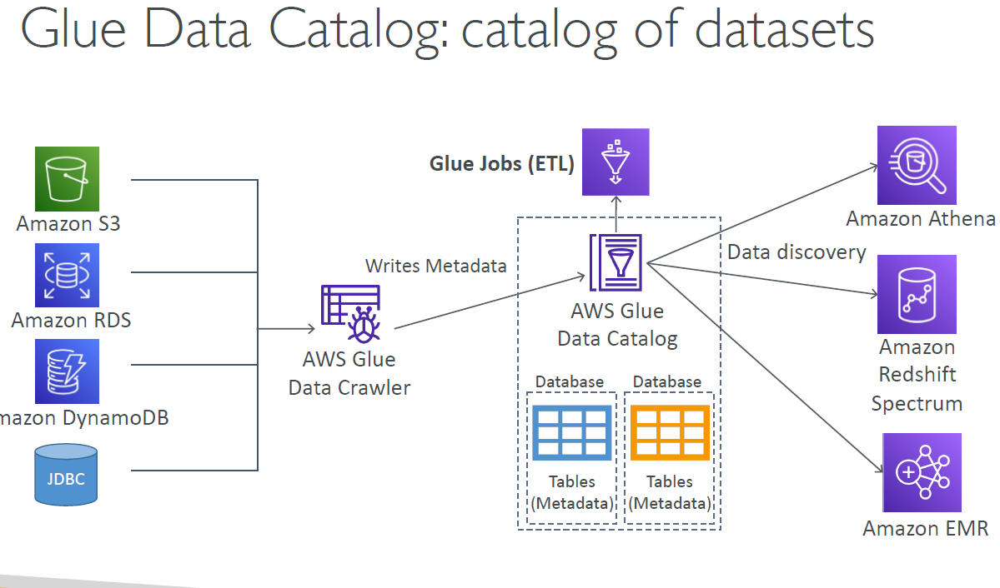

# AWS Glue

- Managed **extract, transform, and load (ETL)** service
- Useful to prepare and transform data for analytics
- Fully serverless service

## Glue – things to know at a high-level

- Glue Job Bookmarks: prevent re-processing old data
- Glue DataBrew: clean and normalize data using pre-built transformation
- Glue Studio: new GUI to create, run and monitor ETL jobs in Glue
- Glue Streaming ETL (built on Apache Spark Structured Streaming):
  compatible with Kinesis Data Streaming, Kafka, MSK (managed Kafka)
